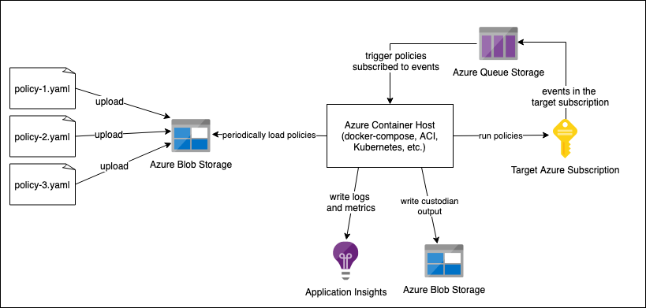
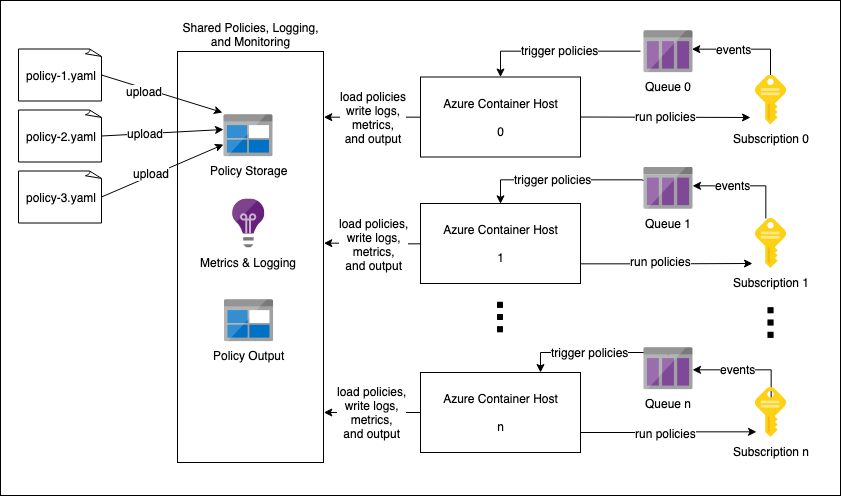

Azure Container Hosting {#azure_containerhosting}
=======================

The Azure Container Host is an alternate execution mode for the cloud
custodian azure provider. Running the Azure Container Host is done with
the [official custodian docker
image](https://hub.docker.com/r/cloudcustodian/c7n). See the
`ACI <azure_configuration_acitutorial>`{.interpreted-text role="ref"}
and `Kubernetes <azure_configuration_helmtutorial>`{.interpreted-text
role="ref"} deployment tutorials to get started running the Azure
Container Host.

Overview
--------

The Azure Container Host will periodically scan azure blob storage for a
set of custodian policies to execute in either a periodic or event based
mode against a target subscription. For periodic policies, the container
host will execute the policy on the cron schedule that is provided. For
event based policies, the container host maintains an azure queue that
subscribes to events in the target azure subscription.

Once the Azure Container Host is deployed, any policies uploaded to blob
storage are automatically loaded and running against an Azure
Subscription. This makes it very easy to manage and run a large number
of policies.



It is also possible to configure a set of container hosts to each
monitor an Azure Subscription. This can be useful for monitoring a
Management Group or other collections of subscriptions. These Container
Hosts could be managed with any container orchestration, but we provide
the tooling and
`a tutorial <azure_configuration_helmtutorial>`{.interpreted-text
role="ref"} for deploying container hosts inside Kubernetes with a Helm
chart.



In this diagram, each Container Host is reading and writing to the same
policy and monitoring resources, but they could each be configured to
interact with their own Storage Accounts or Application Insights
instances.

Supported Policy Modes
----------------------

The container host will only run policies with one of the following
modes specified. Otherwise, the policy will be ignored.

### Periodic

Periodic policies must specify a mode with type `container-periodic` and
a cron schedule. This schedule can specify when the policy should run.
For example: once every hour, on midnight on every weekday, or once a
month.

``` {.yaml}
policies:
- name: run-every-day-at-midnight
  resource: azure.resourcegroup
  mode:
    type: container-periodic
    schedule: '0 0 * * *'
```

### Event Based

Event based policies must specify a mode with the type `container-event`
and a set of events that will trigger the execution. For example: after
a new resource group is created.

``` {.yaml}
policies:
- name: run-on-new-resource-group
  resource: azure.resourcegroup
  mode:
    type: container-event
    events: 
      - resourceProvider: Microsoft.Resources/subscriptions/resourceGroups
        event: write
```

Configuration
-------------

Configuration for the container host is provided as environment
variables. There are several environment variables specific to the
container host:

  ----------------------------------------------------------------------------------------------------------------------------------
  Variable Name                           Required   Description
  --------------------------------------- ---------- -------------------------------------------------------------------------------
  `AZURE_CONTAINER_POLICY_URI`            required   The URL to the azure blob container to load custodian policies from.

  `AZURE_CONTAINER_STORAGE_RESOURCE_ID`   required   The resource id of the storage account to hold the event queue.

  `AZURE_CONTAINER_QUEUE_NAME`                       The name of the event queue that the container host will listen on. If this
                                                     does not exist, it will be created. Defaults to the target subscripition id.

  `AZURE_CONTAINER_LOG_GROUP`                        The application insights to send log output to. In the format:
                                                     `azure://<instrumentation_key_guid>`.

  `AZURE_CONTAINER_METRICS`                          The application insights to send metrics output to. In the format:
                                                     `azure://<instrumentation_key_guid>`.

  `AZURE_CONTAINER_OUTPUT_DIR`                       The URL of the storage account blob container to send log output to. In the
                                                     format:
                                                     `azure://<storage_account_name>.blob.core.windows.net/<blob_container_name>`.
  ----------------------------------------------------------------------------------------------------------------------------------

In addition to the above environment variables, authentication must be
provided to the container host. See
`azure_authentication`{.interpreted-text role="ref"} for authenticating
the container host with an azure identity.

Once an identity has been established, it will need the following roles
in azure:

-   `Reader` and `Storage Blob Data Contributor` on the Storage Account
    that holds the policy files.
-   `Contributor` and `Storage Queue Message Processor` on the Storage
    Account that the event queue will live in.
-   Any other roles that are needed to run the policies that the
    container host will run. For example, if there is a policy that
    filters the `azure.vm` resource, the `Reader` role will be required
    for the VMs that are in the container host\'s target subscription.

Running Locally
---------------

The container host can be run locally with
`python -m c7n_azure.container_host.host`. You will need to provide all
of the same configuration specified above through either environment
variables or CLI options. Run
`python -m c7n_azure.container_host.host --help` for more information.

Deployment Options
------------------

For quick deployments, we provide tooling for 2 methods of deploying the
Azure Container Host:
`ACI <azure_configuration_acitutorial>`{.interpreted-text role="ref"},
and
`Kubernetes with a Helm chart <azure_configuration_helmtutorial>`{.interpreted-text
role="ref"}.
