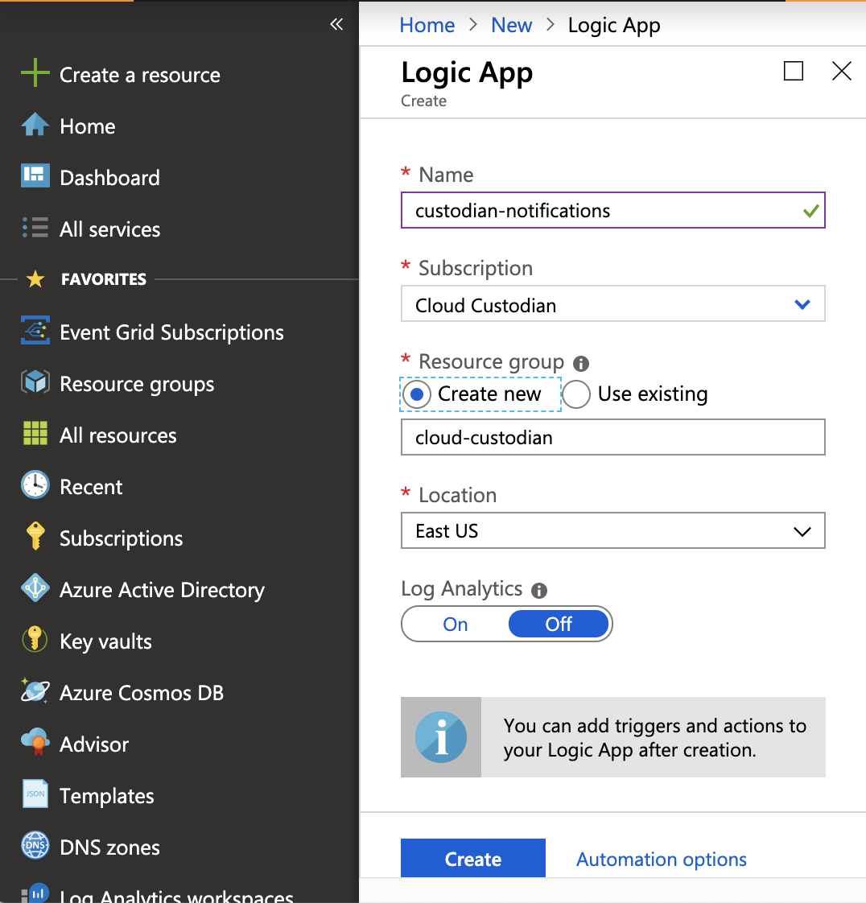
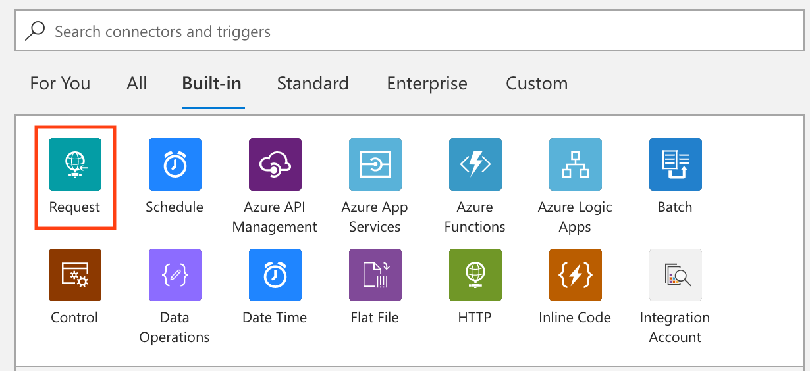
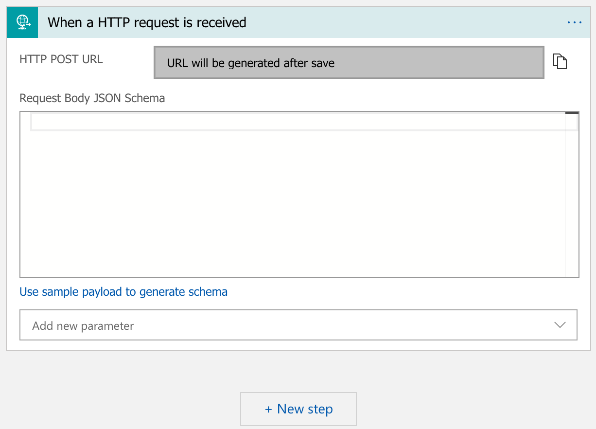
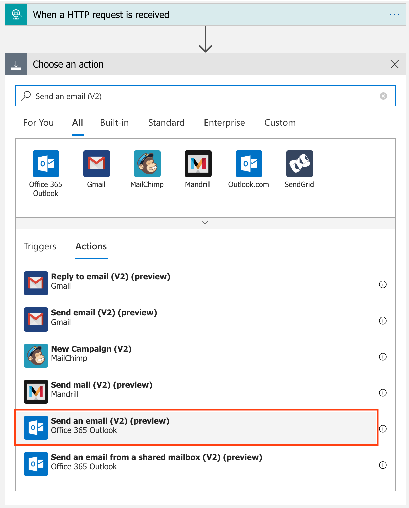
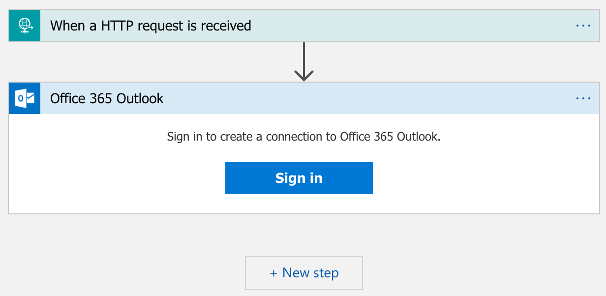
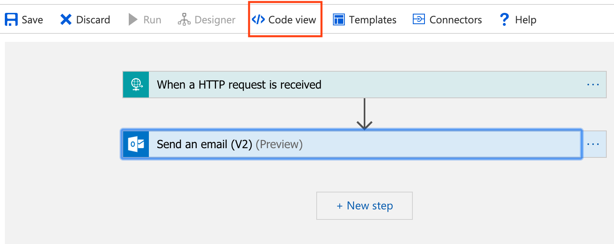
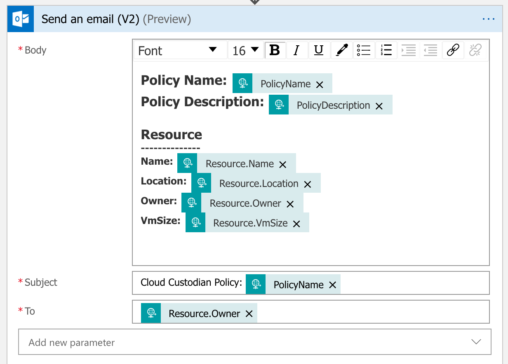
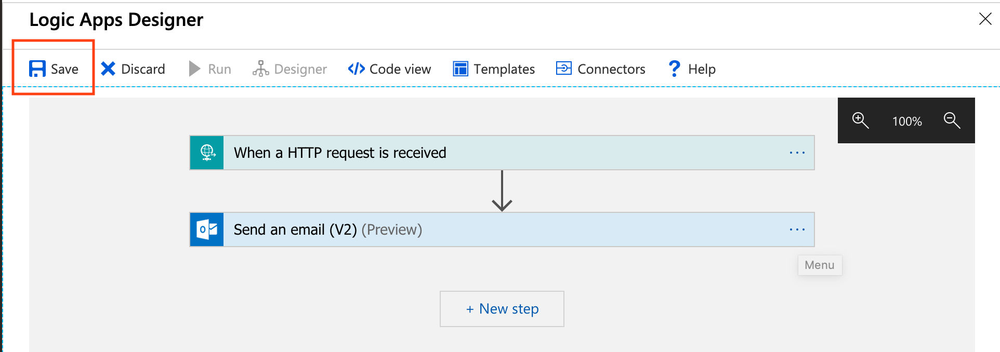
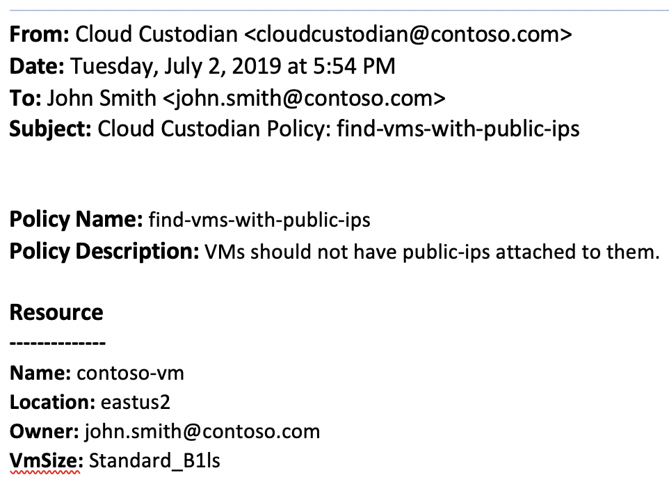

Email - Use Azure Logic Apps to notify users of policy violations {#azure_examples_notifications_logic_app}
=================================================================

Azure Logic Apps are a great option to create simple scalable workflows
in Azure, such as sending an email or posting to Microsoft Teams. In
this example, we will create a workflow that is invoked by Custodian\'s
`logic-app <Azure.common.actions.logic-app>`{.interpreted-text
role="ref"} action.

Create and configure Azure Logic App
------------------------------------

We will now walk through the steps to configure a Logic Apps workflow
that will consist of an [Request]{.title-ref} trigger and an [Outlook
send email]{.title-ref} action.

### Create a new Azure Logic App

1.  From the main Azure menu, choose **Create a resource ─▶ Integration
    ─▶ Logic App.**
2.  Configure your logic app as shown below. For this example, let\'s
    name the Logic App **custodian-notifications**. After you\'re done,
    hit **Create**.



3.  After the Logic App is created, go to the resource and select
    **Blank Logic App** under **Templates**.

### Create Request trigger

1.  Under the **Built-in** tab, select **Request**.



2.  Select **When a HTTP request is received**. This will setup a HTTP
    trigger for your Logic App.



Hitting the **Save** button will generate the URL that will be used to
invoke your Logic App.

### Create the Outlook Send Email action

1.  Click the **+ New Step** to create an action to send an email.
2.  In the search box, search for **Send an email (V2)**. Under the
    **Actions** tab, select the **Office 365 Outlook** action.



3.  Sign into an Office 365 account to create a connection for your
    Logic App. This account will be used to send emails once the
    workflow is invoked.



4.  Next, customize the email template that will be sent. Go to into the
    **Code View** mode by hitting the **Code View Button**.



5.  Inside the **definition** property, update the **actions** property
    to look like the following:

``` {.}
"actions": {
  "Send_an_email_(V2)": {
      "inputs": {
          "body": {
              "Body": "<p><span style=\"font-size: 16px\"><strong>Policy Name: </strong></span>@{triggerBody()['PolicyName']}<br>\n<span style=\"font-size: 16px\"><strong>Policy Description:</strong></span><strong> </strong>@{triggerBody()['PolicyDescription']}<br>\n<strong><br>\n</strong><span style=\"font-size: 16px\"><strong>Resource</strong></span><strong><br>\n--------------<br>\nName: </strong>@{triggerBody()['Resource']['Name']}<br>\n<strong>Location: </strong>@{triggerBody()['Resource']['Location']}<br>\n<strong>Owner: </strong>@{triggerBody()['Resource']['Owner']}<br>\n<strong>VmSize: </strong>@{triggerBody()['Resource']['VmSize']}<br>\n<br>\n</p>",
              "Subject": "Cloud Custodian Policy: @{triggerBody()['PolicyName']}",
              "To": "@{triggerBody()['Resource']['Owner']}"
          },
          "host": {
              "connection": {
                  "name": "@parameters('$connections')['office365']['connectionId']"
              }
          },
          "method": "post",
          "path": "/v2/Mail"
      },
      "runAfter": {},
      "type": "ApiConnection"
  }
}
```

6.  Return back to the **Designer** mode. The template now appears in
    the **Send an email (V2)** action.



7.  Save the workflow. We now have a Logic App workflow that can be
    invoked via a HTTP request to send an email with an Office 365
    account.



Author Cloud Custodian policy
-----------------------------

Let\'s start with an existing policy such as the
`Find Virtual Machines with Public IP address <azure_examples_vm_with_public_ips>`{.interpreted-text
role="ref"} policy. This policy will find all Azure Virtual Machines
that have public IPs attached to them.

``` {.yaml}
policies:
  - name: find-vms-with-public-ips
    description: |
      VMs should not have public-ips attached to them.
    resource: azure.vm
    filters:
      - type: network-interface
        key: properties.ipConfigurations[].properties.publicIPAddress.id
        value: not-null
```

### Add Logic App action

Add a `logic-app <Azure.common.actions.logic-app>`{.interpreted-text
role="ref"} action to the policy to invoke the newly created Logic App.
This action expects a **CreatorEmail** tag to be added on each resource.
This can be done by Custodian using the
`auto-tag-user <azure_examples_autotagusers>`{.interpreted-text
role="ref"} policy.

``` {.yaml}
actions:
  - type: logic-app
    resource-group: cloud-custodian            # ─▶ This is the resource group where you created your Logic App
    logic-app-name: custodian-notifications    # ─▶ This is the name of your Logic App
    batch: false                               # ─▶ We want to invoke the Logic App for each resource that violates our policy
    body: >                                    # ─▶ We will select specific properties of our resource that can be used in our Logic App
        {
        PolicyName: policy.name,
        PolicyDescription: policy.description,
        Resource: resource.
            {
            Name: name,
            Location: location,
            Owner: tags.CreatorEmail,                  # ─▶ The CreatorEmail tag on the resource will be recipient of the email.
            VmSize: properties.hardwareProfile.vmSize
            }
        }
```

### Final updated policy

``` {.yaml}
policies:
  - name: find-vms-with-public-ips
    description: |
      VMs should not have public-ips attached to them.
    resource: azure.vm
    filters:
      - type: network-interface
        key: properties.ipConfigurations[].properties.publicIPAddress.id
        value: not-null
    actions:
      - type: logic-app
        resource-group: cloud-custodian
        logic-app-name: custodian-notifications
        batch: false
        body: >
          {
            PolicyName: policy.name,
            PolicyDescription: policy.description,
            Resource: resource.
              {
                Name: name,
                Location: location,
                Owner: tags.CreatorEmail,
                VmSize: properties.hardwareProfile.vmSize
              }
          }
```

Test the policy
---------------

### Policy violating virtual machine

Find a Virtual Machine with a **Public IP Address**, which is a
violation of the
`find-vms-with-public-ips <azure_examples_vm_with_public_ips>`{.interpreted-text
role="ref"} policy. Next, either manually add a **CreatorEmail** tag to
it or execute the
`auto-tag-user <azure_examples_autotagusers>`{.interpreted-text
role="ref"} policy targeting [Virtual Machine]{.title-ref} resources.


### Email sent from logic app

When we execute the policy above, it will invoke the **logic-app**
action, which will result in the following email to be sent:


