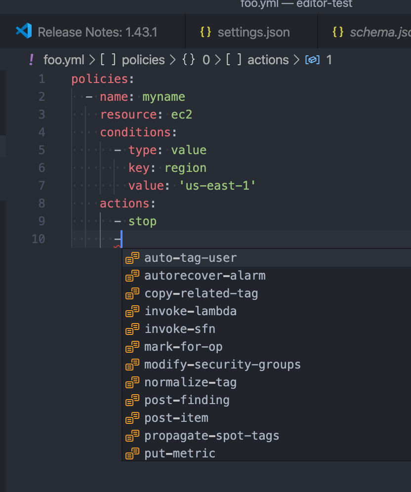

# Getting Started 

See also the readme in the GitHub repository.

-   `install-cc`{.interpreted-text role="ref"}
-   `explore-cc`{.interpreted-text role="ref"}
-   `cloud-providers`{.interpreted-text role="ref"}
-   `monitor-cc`{.interpreted-text role="ref"}
-   `tab-completion`{.interpreted-text role="ref"}
-   `community`{.interpreted-text role="ref"}

## Install Cloud Custodian

These instructions will install Cloud Custodian. Cloud Custodian is a
Python application that supports Python 3 on Linux, MacOS and Windows.
We recommend using Python 3.6 or higher.

NOTE: Ensure you install the correct follow-on package depending on the
cloud you are deploying to, otherwise you won\'t have the right modules
for that specific cloud.

=== "Linux and OSX"

    To install Cloud Custodian :

        python3 -m venv custodian
        source custodian/bin/activate
        pip install c7n       # This includes AWS support

    To install Cloud Custodian for Azure, you will also need to run:

        pip install c7n_azure # Install Azure package

    To install Cloud Custodian for GCP, you will also need to run:

        pip install c7n_gcp   # Install GCP Package

=== "Windows" 
    
    To install Cloud Custodian run:

        python3 -m venv custodian
        ./custodian/bin/activate
        pip install c7n    # This includes AWS support

    To install Cloud Custodian for Azure, you will also need to run:

        pip install c7n_azure

    To install Cloud Custodian for GCP, you will also need to run:

        pip install c7n_gcp

=== "Docker"

    To install via docker, run:

        docker pull cloudcustodian/c7n

    You'll need to export cloud provider credentials to the container when
    executing. One example, if you\'re using environment variables for
    provider credentials:

        docker run -it \
          -v $(pwd)/output:/home/custodian/output \
          -v $(pwd)/policy.yml:/home/custodian/policy.yml \
          --env-file <(env | grep "^AWS\|^AZURE\|^GOOGLE") \
             cloudcustodian/c7n run -v -s /home/custodian/output /home/custodian/policy.yml

## Explore Cloud Custodian

Run `custodian -h` to see a list of available commands.

Run `custodian schema` to see the complete list of cloud resources
against which you can run policies. To invoke command-line help with
more information about policy schema details, run `custodian schema -h`.

Run `custodian schema <cloud-provider>` to see the available resources
for a specific cloud provider: `custodian schema aws`

Run `custodian schema <cloud-provider>.<resource>` to see the available
filters and actions for each resource.

Drill down to get more information about available policy settings for
each resource, where the model for the command is:

    custodian schema <cloud>.<resource>.<category>.<item>

For example:

    custodian schema aws.s3.filters.is-log-target

provides the following information:

    Help
    ----

    Filter and return buckets are log destinations.

    Not suitable for use in lambda on large accounts, This is a api
    heavy process to detect scan all possible log sources.

    Sources:
      - elb (Access Log)
      - s3 (Access Log)
      - cfn (Template writes)
      - cloudtrail

    :example:

        .. code-block: yaml

            policies:
              - name: s3-log-bucket
                resource: s3
                filters:
                  - type: is-log-target

    Schema
    ------

    {   'additionalProperties': False,
        'properties': {   'type': {   'enum': ['is-log-target']},
                          'value': {   'type': 'boolean'}},
        'required': ['type'],
        'type': 'object'}

Additionally, you can use the schema command to view information on the
different supported modes in Cloud Custodian:

    custodian schema mode

## Cloud Provider Specific Help

For specific setup isntructions for AWS, Azure, and GCP, visit the
relevant getting started page.

-   `AWS <aws-gettingstarted>`{.interpreted-text role="ref"}
-   `Azure <azure_gettingstarted>`{.interpreted-text role="ref"}
-   `GCP <gcp_gettingstarted>`{.interpreted-text role="ref"}

## Troubleshooting & Tinkering

The policy is validated automatically when you run it, but you can also
validate it separately:

    custodian validate custodian.yml

You can also check which resources are identified by the policy, without
running any actions on the resources:

    custodian run --dryrun -s . custodian.yml

## Monitor resources

Additional commands let you monitor your services in detail.

You can generate metrics, log outputs, and output to blob storage in
each of the different providers (AWS, Azure, Google Cloud Platform).

For detailed instructions on how to add metrics, logging, and blob
storage output for the different clouds, check out the cloud provider
specific pages:

-   `AWS <aws-gettingstarted>`{.interpreted-text role="ref"}
-   `Azure <azure_gettingstarted>`{.interpreted-text role="ref"}
-   `GCP <gcp_gettingstarted>`{.interpreted-text role="ref"}

For details, see `usage`{.interpreted-text role="ref"}.

## Editor Integration

If your preferred editor supports language servers, you can configure it
to provide completion and validation while authoring policies.

First generate use custodian to generate a json schema file:

    custodian schema --json > schema.json

Next install a YAML plug-in for your editor, like [YAML for Visual
Studio
Code](https://marketplace.visualstudio.com/items?itemName=redhat.vscode-yaml)
or [coc-yaml for coc.nvim](https://github.com/neoclide/coc-yaml). Both
plug-ins use the
[yaml-language-server](https://github.com/redhat-developer/yaml-language-server)
under the hood.

You\'ll then need to configure your plug-in to use the generated
[schema.json]{.title-ref} as the schema for your policy files. For
example in Visual Studio Code, navigate to the settings for the YAML
plug-in and under Schemas, edit configuration file and add the following
schema configuration:

    "yaml.schemas": {
      "./schema.json": "*yml"
    },

Note the path to schema.json can either be either relative or the full
path.

You\'ll now have completion and validation while authoring policies.

Note if you\'re authoring policies in json you can also configure the
json-language-server for the same.

Also, if you\'re seeing errors like
`'Request textDocument/hover failed with message: Cannot read property '$ref' of null'`
try re-creating your schema.json file.

## Tab Completion

To enable command-line tab completion for [custodian]{.title-ref} on
bash do the following one-time steps:

Run:

    activate-global-python-argcomplete

Now launch a new shell (or refresh your bash environment by sourcing the
appropriate file).

## Community Resources

We have a regular community meeting that is open to all users and
developers of every skill level. Joining the [mailing list
https://groups.google.com/forum/\#!forum/cloud-custodian]() will
automatically send you a meeting invite. See the notes below for more
technical information on joining the meeting.

> -   [Community Meeting
>     Videos](https://www.youtube.com/watch?v=qy250y0UT-4&list=PLJ2Un8H_N5uBeAAWK95SnWvm_AuNJ8q2x)
> -   [Community Meeting Notes
>     Archive](https://github.com/cloud-custodian/community/discussions)

## Troubleshooting

If you get an error about \"complete -D\" not being supported, you need
to update bash. See the \"Base Version Compatability\" note [in the
argcomplete
docs](https://argcomplete.readthedocs.io/en/latest/#global-completion):

If you have other errors, or for tcsh support, see [the argcomplete
docs](https://argcomplete.readthedocs.io/en/latest/#activating-global-completion).

If you are invoking [custodian]{.title-ref} via the [python]{.title-ref}
executable tab completion will not work. You must invoke
[custodian]{.title-ref} directly.